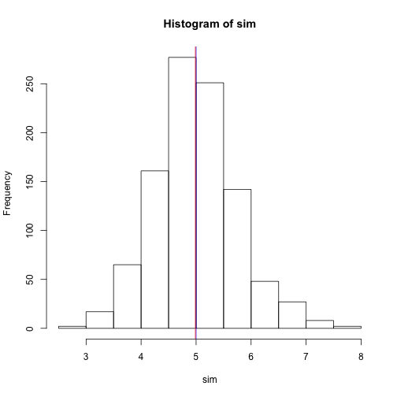
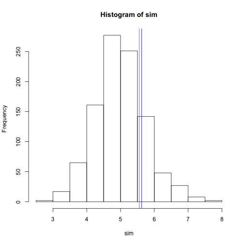

# Overview

In this analysis we explore the exponential distribution and compare to the random uniform distribution. We perform 1000 iterations to verify the effects of the Central Limit Theorem. The means of the sample distributions are taken to create a distribution of means to evaluate.

# Simulations

For the exponential distribution we are choosing a lambda of 0.2. For each distribution, there will be 40 observations. We will be taking the mean of each of these distributions and iterating this process 1000 times to create a distribution of the means.


```r
n <- 40; lambda <- 0.2
sim <- NULL
for (i in 1:1000) {
  sim <- c(sim, mean(rexp(n, lambda)))
}
```

# Sample Mean v Theoretical Mean


```r
mn <- mean(sim)
mn
```

```
## [1] 4.987
```

```r
hist(sim)
abline(v= 1/lambda, col = "blue")
abline(v= mean(sim), col = "red")
```

 

The sample mean (red) has an absolute error of 0.26% from the theoretical mean (blue). We see in the histogram that the two are not far from each other which promotes randomization in the function `rexp`.

# Sample Variance v Theoretical Variance


```r
vr <- var(sim)
vr
```

```
## [1] 0.5561
```

```r
theo.vr <- (1/lambda)^2/n

hist(sim)
abline(v= 5+theo.vr, col = "blue")
abline(v= 5+vr, col = "red")
```

 

The figure shows the theoretical mean plus the sample variance (red) and the theoretical variance (blue). Normally the standard deviation is added to the mean, however we wanted to assess the difference in variances so to put them on the same scale as the histogram I simply added the theoretical mean to both.

The sample variance has an absolute error of 11.02% from the theoretical variance. 

# Distribution


```r
summary(sim)
```

```
##    Min. 1st Qu.  Median    Mean 3rd Qu.    Max. 
##    2.77    4.51    4.96    4.99    5.44    7.73
```

```r
hist(sim)
```

 

```r
mns = NULL
for (i in 1:1000) mns = c(mns, mean(runif(40)))
hist(mns)
```

 

From the summary of the simulation data we see that the median is less than the mean indicating a slight skew to the right. The histogram visibly shows this as well. However when compared to the random uniform distribution, they both appear to be symmetric about their means and mound shaped.

